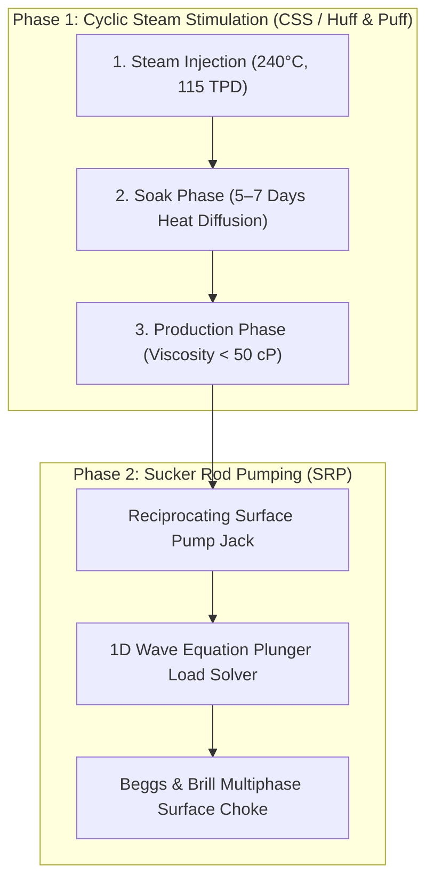
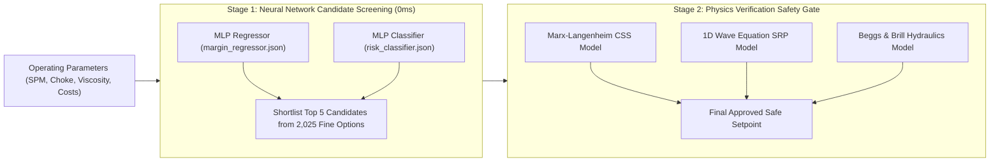

# Baghewala Field Digital Twin (v2.0)
## A Plain-Language Guide to the Heavy-Oil Well Simulation & Optimization Dashboard

> **Covers**: The real-world Baghewala oil field, the physical production challenges, the 2-Stage Hybrid Neural Network + Physics Architecture, the 5 dedicated interface routes, a full glossary of dashboard terms, and how real-time data flows through the system.
> 
> **Live Prototype**: [https://baghewala-digital-twin.vercel.app](https://baghewala-digital-twin.vercel.app)  
> **Source Code**: [https://github.com/bharatmalik-cs/Baghewala-digital-twin](https://github.com/bharatmalik-cs/Baghewala-digital-twin)

---

## 1. The Real-World Field Behind This Project

**Baghewala** is an actual, currently operating heavy-oil field located in the Thar Desert of Rajasthan, India (Bikaner-Nagaur Basin), operated by **Oil India Limited (OIL)**. Discovered in 1991, the field spans roughly 200 square kilometers with dozens of wells drilled to date. Crude produced at Baghewala is trucked to ONGC's processing facility in Mehsana, Gujarat, and piped onward to the Koyali refinery operated by Indian Oil Corporation Limited (IOCL).

The field is of national strategic importance: it was the site of India's first-ever Cyclic Steam Stimulation (CSS) pilot in 2018. Recent industry reports confirm record production exceeding 1,200 barrels per day from the Jodhpur Sandstone formation, driven by expanded thermal recovery operations. This digital twin models the physics, lift mechanics, and economics of a real production system that contributes directly to India's domestic energy security.

### Key Reservoir & Crude Facts

| Reservoir Property | Field Value | Operational Significance |
| :--- | :--- | :--- |
| **Formation / Depth** | Jodhpur Sandstone, ~1,150 meters | Sandstone matrix with high porosity & permeability. |
| **Pay Thickness** | ~18 meters | Substantial vertical interval requiring thermal stimulation. |
| **Crude Quality** | Extra-Heavy, 11° – 17° API gravity | High density crude with minimal dissolved light fractions. |
| **Dead-Oil Viscosity** | 3,500 – 10,000 cP at 45°C | Thick as cold honey or molasses at reservoir temperature. |
| **Primary Lift Method** | Sucker Rod Pump (SRP), post-CSS heating | Reciprocating mechanical surface pump jack after steam soak. |

### Why This Oil Won't Flow on Its Own
Imagine trying to suck cold, thick honey through a drinking straw—that represents the physical challenge underground at Baghewala. At natural reservoir temperatures (45°C), the crude is thousands of times thicker than water and cannot flow toward the wellbore under natural pressure. The entire production strategy relies on a simple principle: **heat the crude underground until it thins out, then pump it to the surface before it cools and thickens again.**

---

## 2. The Production Cycle: CSS + SRP

Two core petroleum engineering technologies operate together at every well:



### Step 1 — Cyclic Steam Stimulation (CSS / "Huff and Puff")
1. **Injection**: High-pressure steam at ~240°C is pumped down the wellbore into the Jodhpur Sandstone for several days.
2. **Soaking**: The well is shut in (sealed). Heat diffuses conductively outward from the wellbore, warming the rock and thinning the crude.
3. **Production**: The well is reopened. Warm, mobile crude flows into the wellbore and is pumped to the surface until downhole temperature drops and crude thickens—at which point the cycle repeats.

### Step 2 — Sucker Rod Pumping (SRP)
Once crude is mobile, a reciprocating mechanical pumpjack (the classic "nodding donkey") lifts the oil. A surface motor moves a long steel rod string up and down inside the tubing. Valves at the downhole pump barrel trap oil on the upstroke and push it toward the surface with every cycle.

**The Engineering Challenge**: The pump must operate at a speed (Strokes Per Minute - SPM) and choke valve setting that matches how fast heated crude is actually flowing into the pump barrel. Running too fast or with incorrect back-pressure damages downhole equipment—which the software's prescriptive engine prevents.

---

## 3. The Six Problems the Software Watches For

The digital twin continuously evaluates physical telemetry and flags warning signs before equipment damage occurs:

### 1. Fluid Pound (Downhole Mechanical Impact)
- **Physical Reality**: The pump cycles faster than crude flows into the barrel. On the downstroke, the plunger free-falls through empty space and slams into liquid—striking like a heavy hammer thousands of times daily, destroying rods and surface gearboxes.
- **Software Action**: The system monitors **Pump Fillage (%)**. If fillage drops below 75%, it flags a financial penalty (~$450/day damage risk) and recommends reducing SPM to 4.5–5.5 SPM.

### 2. Gas Lock (Pump Barrel Gas Compression)
- **Physical Reality**: As crude is heated, dissolved gas breaks out as bubbles. Trapped gas in the pump barrel compresses and expands without opening valves, dropping pump efficiency to 0%.
- **Software Action**: The system detects the pressure signature of gas lock, recommending a 15–20% choke opening increase and lower SPM to allow trapped gas to bleed off into flowlines.

### 3. Viscous Friction Drag
- **Physical Reality**: Cold, thick crude retards the rod string during the downstroke. Rods float rather than fall freely, straining surface motors and wasting power.
- **Software Action**: The optimizer calculates a viscous drag penalty ($F_v \propto \mu^{0.35} \cdot \text{SPM}$) and automatically avoids unsafe high speeds when crude viscosity rises.

### 4. Steam Waste (SOR Runaway)
- **Physical Reality**: Injecting steam beyond reservoir absorption capacity wastes heat past the productive zone, inflating fuel costs without yielding additional oil.
- **Software Action**: The engine tracks the Cumulative Steam-to-Oil Ratio (**cSOR**) and raises an alert if cSOR exceeds 8.0 bbl/bbl, signaling steam shutoff.

### 5. Serverless Cloud Reliability (Vercel 24/7 Hosting)
- **Physical Reality**: Serverless cloud infrastructure (Vercel) resets stateless background processes between HTTP requests.
- **Software Action**: The backend physics engine was modularized to execute on-demand per request, using relative REST polling paths (`/api/*`) for 24/7 standalone cloud uptime without requiring a local daemon.

### 6. Data Jitter & Operator Interface Stability
- **Physical Reality**: High-frequency 1-second telemetry updates caused screen flicker, making data difficult to read during operational review.
- **Software Action**: Updated UI refresh rates to a calm 6-second cadence and added a topbar **Pause / Resume** control to freeze live feeds for manual audit.

---

## 4. Multi-Page Navigation & Interface Routes

The dashboard is structured into 5 dedicated routes:

```
┌─────────────────────────────────────────────────────────────────────────────┐
│                       BAGHEWALA DIGITAL TWIN UI                             │
├───────────────┬─────────────────────────────────────────────────────────────┤
│ 📊 Operations │ Live field KPIs, well selector, economic inputs, controls.  │
│ ♨️ CSS Cycle   │ Thermal plume expansion (Marx-Langenheim) & viscosity curve.│
│ 🏗️ Lift Mech   │ 1D Wave Equation Dynacard viewer & polished rod metrics.     │
│ 📋 Audit Log  │ Timestamped decision audit log of all operator adjustments. │
│ 🧠 AI Workbench│ 0ms Pure JS Neural Network evaluator & safety gate view.    │
└───────────────┴─────────────────────────────────────────────────────────────┘
```

1. **Operations Desk (`/`)**: Central control room displaying well status, oil production (BOPD), steam rate (TPD), economic parameter inputs (crude/steam/electricity prices), and physics recommendations.
2. **CSS Cycle Plan (`/css-cycle`)**: Dedicated thermal recovery workspace plotting heated radius ($r_h$), steam quality, and Andrade/Walther viscosity reduction curves ($3,500\,\text{cP} \to <50\,\text{cP}$).
3. **Artificial Lift (`/artificial-lift`)**: Downhole mechanical view running the 1D Gibbs Damped Wave Equation solver to present surface vs. downhole Dynacard load-displacement loops.
4. **Decision Log (`/decision-log`)**: Traceability log recording every manual and auto-applied setpoint change with event timestamps for audit compliance.
5. **Neural AI Evaluator (`/ai-evaluator`)**: Diagnostic workbench showcasing the 0ms browser neural network forward pass alongside the physics safety verification gate.

---

## 5. Glossary of Dashboard Terms

### Well Metrics & Operational Controls
- **BOPD (Barrels of Oil Per Day)**: Daily oil volume produced ($1\text{ bbl} \approx 159\text{ liters}$).
- **SPM (Strokes Per Minute)**: Reciprocating pump speed (0 SPM during steam injection; 4–10 SPM during production).
- **Stroke Length (Inches)**: Vertical rod travel distance per stroke (100" to 144").
- **Pump Fillage (%)**: Percentage of pump barrel filled with liquid oil per upstroke (100% ideal; <70% risks fluid pound).
- **Choke Opening (%)**: Surface back-pressure valve setting (20% restricted; 100% fully open).
- **Steam Rate (TPD)**: Tonnes Per Day of high-pressure steam injected (e.g. 115 TPD at 240°C).

### Thermal Recovery (CSS) Terms
- **CSS (Cyclic Steam Stimulation)**: 3-phase thermal EOR: Injection $\to$ Soaking $\to$ Production.
- **Dead Oil Viscosity (cP)**: Crude viscosity at 45°C reservoir temperature without gas (~3,500+ centipoise).
- **cP (Centipoise)**: Viscosity unit. Water = 1 cP, light crude $\approx$ 10 cP, Baghewala crude = 3,500+ cP.
- **Thermal Plume / Heated Radius (m)**: Distance steam heat penetrates into reservoir rock (~15–25m).
- **iSOR / cSOR (Steam-to-Oil Ratio)**: Barrels of steam used per barrel of oil produced ('i' = instantaneous; 'c' = cumulative).

### Mechanical & Hydraulic Terms
- **Dynacard**: Plot of rod load vs. position used to diagnose downhole pump health 1,000m underground.
- **Polished Rod**: Smooth surface rod segment moving through the wellhead stuffing box.
- **Hydraulic Pressures**: Pressure drop progression: Reservoir (~110 bar) $\to$ Pump Intake (~55 bar) $\to$ Wellhead (~18 bar) $\to$ Separator (5 bar).

### Hybrid AI & Optimization Terms
- **2-Stage Hybrid Architecture**: Coupling fast Neural Network candidate screening with First-Principles Physics safety verification.
- **MLP Regressor (`margin_regressor.json`)**: Pre-trained Neural Network predicting daily margin ($/day).
- **MLP Classifier (`risk_classifier.json`)**: Pre-trained Neural Network predicting risk flags (`NORMAL`, `FLUID_POUND`, `GAS_LOCK`, `VISCOUS_DRAG`).
- **Net Field Margin ($/day)**: Daily revenue minus steam, electricity, and equipment risk costs.
- **Safety Gate**: First-Principles Physics rules that override NN recommendations if mechanical risks are detected.

---

## 6. How the 2-Stage Hybrid Neural Network + Physics Architecture Works

### Is an AI Model Used in the New Version?
**YES.** Version 2.0 incorporates a **2-Stage Hybrid AI Architecture** combining machine learning with petroleum engineering physics:



### Stage 1: Pure NumPy & Pure JS Neural Network (0ms Inference)
- **Zero Heavy Dependencies**: Runs using a lightweight forward-pass matrix multiplication engine (`MLPFromJSON`) implemented in pure NumPy (`inference_numpy.py`) for Python and pure Vanilla JS (`inference.js`) for the browser.
- **Ultra-Fast Candidate Search**: Evaluates **2,025 fine grid candidates** in **0 milliseconds**, predicting profit margins and equipment risks instantly in client browser memory or serverless functions.

### Stage 2: First-Principles Physics Safety Gate
- **Physics Authority**: While the Neural Network quickly screens candidate settings, **First-Principles Physics models (`CSSModel`, `SRPModel`, `HydraulicsModel`) remain the sole authority** for safety checks.
- **Risk Prevention**: If the Neural Network recommends a high-margin setpoint that violates physical downhole constraints (e.g. fluid pound or gas lock), the Physics Safety Gate overrides or penalizes the candidate before it reaches the operator console.

---

### Data Flow Architecture

```
┌────────────────────────┐      REST HTTP / Polling (6s)      ┌────────────────────────┐
│  Python FastAPI Server │ ─────────────────────────────────> │ React 19 Frontend SPA  │
│  (Serverless / Local)  │ <───────────────────────────────── │  (Vite / Tailwind v4)  │
└────────────────────────┘        Control Setpoints           └────────────────────────┘
```

1. **Telemetry Generation**: The backend physics engine computes well state, downhole pressures, thermal expansion, and mechanical loads.
2. **REST API Polling**: The React frontend fetches `/api/well/{id}/telemetry` every 6 seconds.
3. **Browser Inference**: The frontend executes `inference.js` in client memory to compare real-time telemetry against pre-trained Neural Network predictions.
4. **Human-in-the-Loop Approval**: Recommended setpoints require operator confirmation before updating telemetry parameters.

---

> **Sources**: Oil India Limited (OIL) technical disclosures; Oil & Gas Journal (2018); Business Standard & PSU Watch reporting on Baghewala production; Baghewala Field Digital Twin v2.0 codebase documentation.
